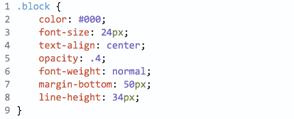

# sublime-postcss-sorting

Sublime Text plugin to sort CSS rules content with specified order. Powered by [postcss-sorting](https://github.com/hudochenkov/postcss-sorting).



Works only with CSS and PostCSS and not with preprocessors like Sass or LESS.


## Install

Install `PostCSS Sorting` with [Package Control](https://packagecontrol.io/) and restart Sublime Text.

**You need to have [Node.js](https://nodejs.org) >= 0.12.0 installed.**  
Make sure it's in your $PATH by running `node -v` in your command-line.  
On OS X you need to make sure it's in `/usr/local/bin` or symlink it there.


## Getting started

In a CSS or PostCSS file, open the Command Palette (<kbd>Cmd</kbd> + <kbd>Shift</kbd> + <kbd>P</kbd> (OS X), <kbd>Ctrl</kbd> + <kbd>Shift</kbd> + <kbd>P</kbd> (Windows/Linux)) and choose `Run PostCSS Sorting`. You can alternatively create one or more selections before running the command to only sort those parts. It should be whole rule.

There is keyboard shortcut also: <kbd>Ctrl</kbd> + <kbd>Shift</kbd> + <kbd>S</kbd> (OS X), <kbd>Ctrl</kbd> + <kbd>Alt</kbd> + <kbd>Shift</kbd> + <kbd>S</kbd> (Windows/Linux).


### Options

*(Preferences → Package Settings → PostCSS Sorting → Settings - User)*

You can specify sort order and grouping. See the [postcss-sorting documentation](https://github.com/hudochenkov/postcss-sorting#options) for all rules and predefined configs.


#### Default

```json
{
	"sort-order": "default"
}
```


### Project settings

You can override the default and user settings for individual projects. Just add an `"PostCSSSorting"` object to the `"settings"` object in the project's `.sublime-project` file containing your [project specific settings](http://www.sublimetext.com/docs/3/projects.html).

Example:

```json
{
	"settings": {
		"PostCSSSorting": {
			"sort-order": ["padding", "margin"]
		}
	}
}
```


## Acknowledgements

This plugin is based on the [sublime-autoprefixer plugin](https://github.com/sindresorhus/sublime-autoprefixer) by Sindre Sorhus.
